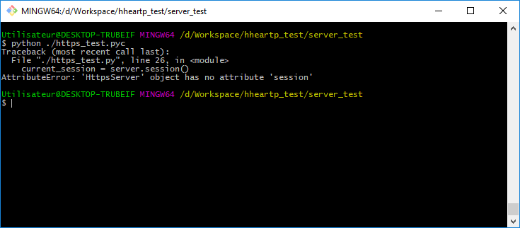

# server_test

The `Server` class is a base class used in the test cases of our test package. One of the developers has reported an issue with the `https_test`:

However, the `http_test` is working fine:

### How would you identify the problem?

- Describe the process you will follow. 
- Is the code provided enough to understand the problem?
- Could you write a few lines of code to verify and support your conclusion?
